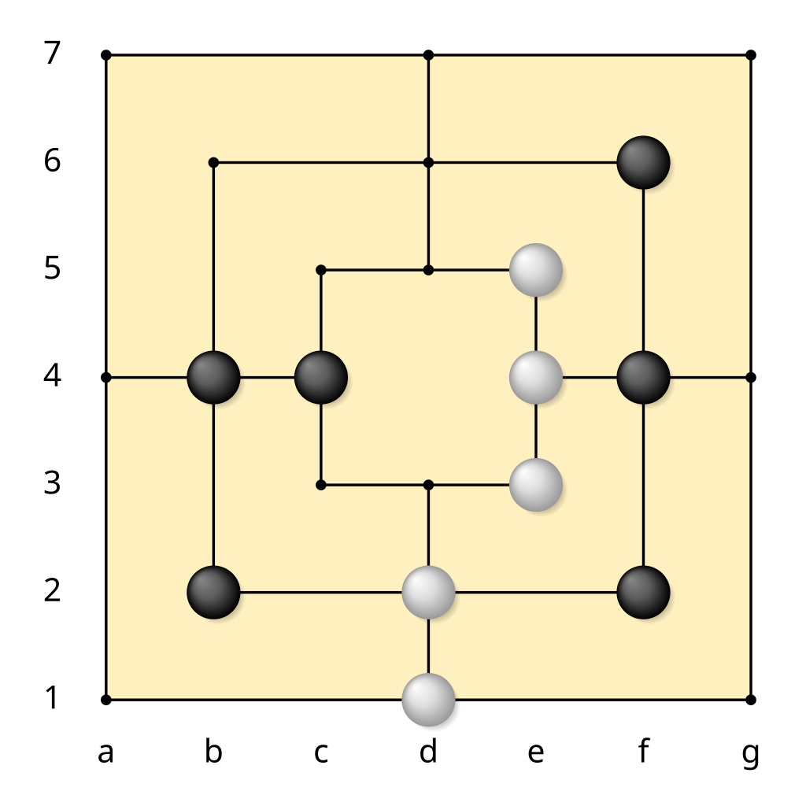

# MaRL - Reinforcement Learning for Nine Men's Morris

## Overview
MaRL (Marelle Reinforcement Learning) is a project that explores the application of reinforcement learning algorithms to solve the board game **Nine Men's Morris** (also known as "Jeu du Moulin" or "La Marelle"). The goal of this project is to train an AI agent capable of playing the game at a competitive level using modern deep reinforcement learning techniques.

## Features
- Implementation of reinforcement learning algorithms
- Deep Reinforcement Learning using **PyTorch**
- Environment implementation and interaction for **Nine Men's Morris**

## Installation
### Prerequisites
Before running the project, ensure you have the following dependencies installed:

- Python 3.8+
- PyTorch
- Gym (for reinforcement learning environment management)
- NumPy
- Matplotlib (for visualization)

### Setup
Clone the repository:

```sh
$ git clone https://github.com/clement2323/MaRL.git
$ cd MaRL
```
[rules](https://en.wikipedia.org/wiki/Nine_men%27s_morris)

